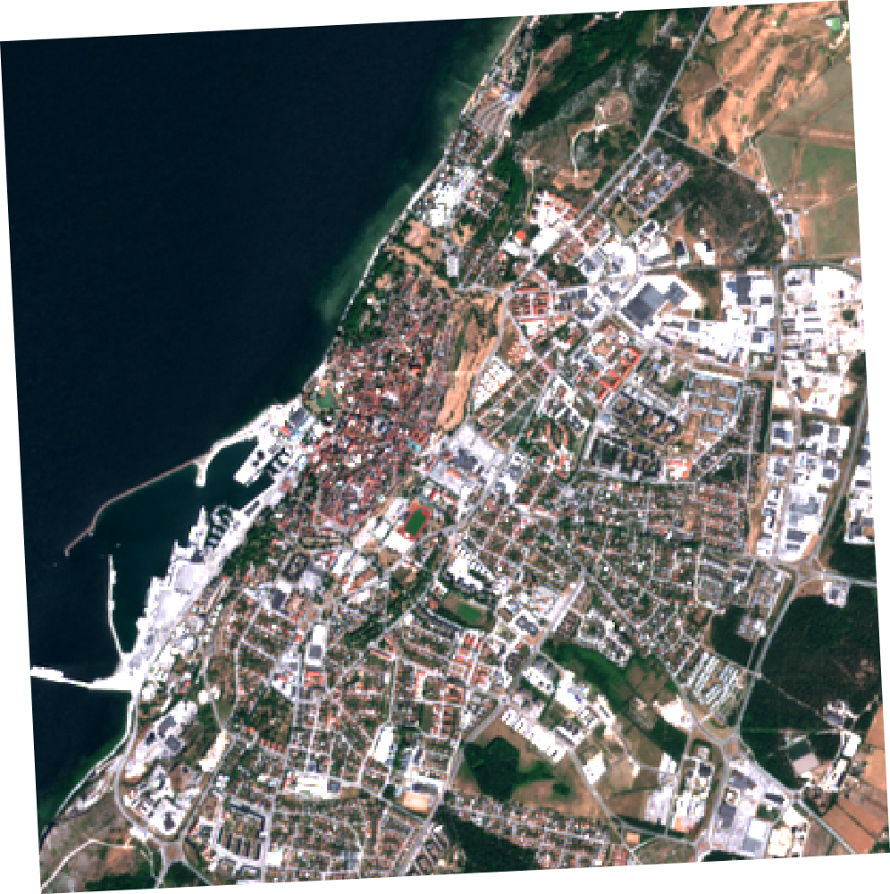
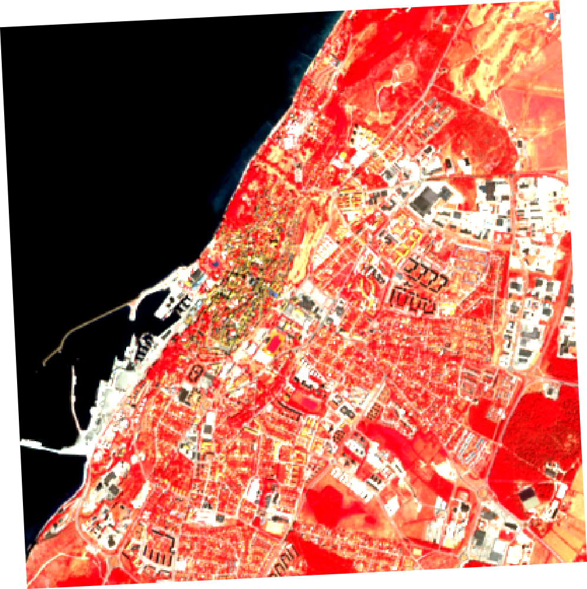

# MTF Satellite data API

This documentation describes how to use the satellite data REST API designed for MTF.

TODO: describe the data source

# API

The API is available at `https://mtf-satellite.synvinkel.org/timeseries/`.

## Response

Using either of the endpoints and options described below will return a JSON like this:

```
{
    success: true,
    data:{
        location: {"lng": 0, "lat": 0},
        images: [
            {
                bands: {
                        B1: 3645,
                        B2: 4324,
                        etc...
                    },
                cloudcover: 30.8,
                date: "2018-06-05",
                url: "https://---imageurl---",
            },
            ...etc
        ]
    }
}
```

Requests that fail for one reason or another will return

```
{
    success: false,
    message: "A friendly and hopefully helpful error message"
}
```

## By coordinates

A timeseries for a specific location can be requested by adding the `lng` and `lat` query parameters:

```
https://mtf-satellite.synvinkel.org/timeseries?lng=106.18&lat=53.98
```

## By placename

Requesting by placename can be done with `/timeseries/{name}`

```
https://mtf-satellite.synvinkel.org/timeseries/{name}
```

## Options

Options can be appended to the endpoints described above to narrow down the result. This is a great way to make your request process faster.

### maxCloudCover

Use `maxCloudCover` to filter by cloud cover percentage. Must be a number between 0 and 100.

```
https://mtf-satellite.synvinkel.org/timeseries/{name}?maxCloudCover=50
```

### fromDate, startDate

Filtering by a specific date range is done by providing `startDate` and `endDate` in YYYY-MM-DD format (e.g. 2018-01-31) 

```
https://mtf-satellite.synvinkel.org/timeseries/{name}?startDate=2018-06-01&endDate=2018-07-23
```

### season

To only include images taken during a certain season you can provide `spring`,`summer`,`fall` or `winter` for the `season` query parameter. Season is defined in a very much northensperocentric manner.

```
https://mtf-satellite.synvinkel.org/timeseries/{name}?season=winter
```

# Images

The url provided in the timeseries result will process and return the requested image as a png. 

## Options

You can set `visualize` to either `rgb` or `falsecolor`... **TODO**: better wording / expand / explain

```
https://mtf-sat.synvinkel.org/image/18.30005/57.63845/20180613T101019_20180613T101424_T33VXD.png
```

```
https://mtf-sat.synvinkel.org/image/18.30005/57.63845/20180613T101019_20180613T101424_T33VXD.png?visualize=falsecolor
```



