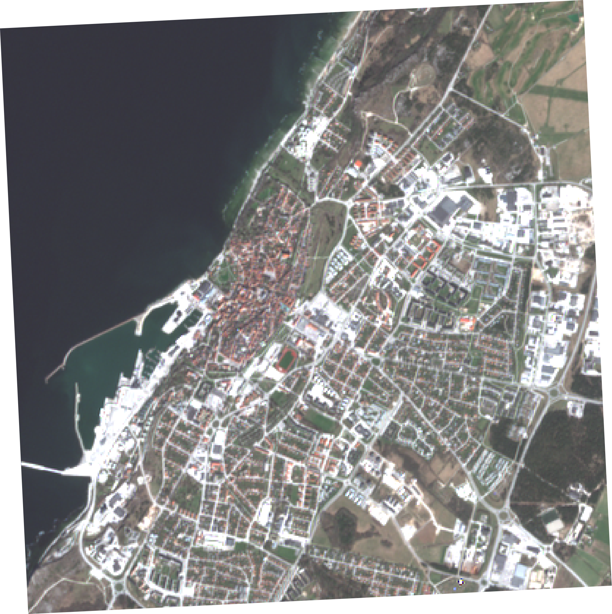
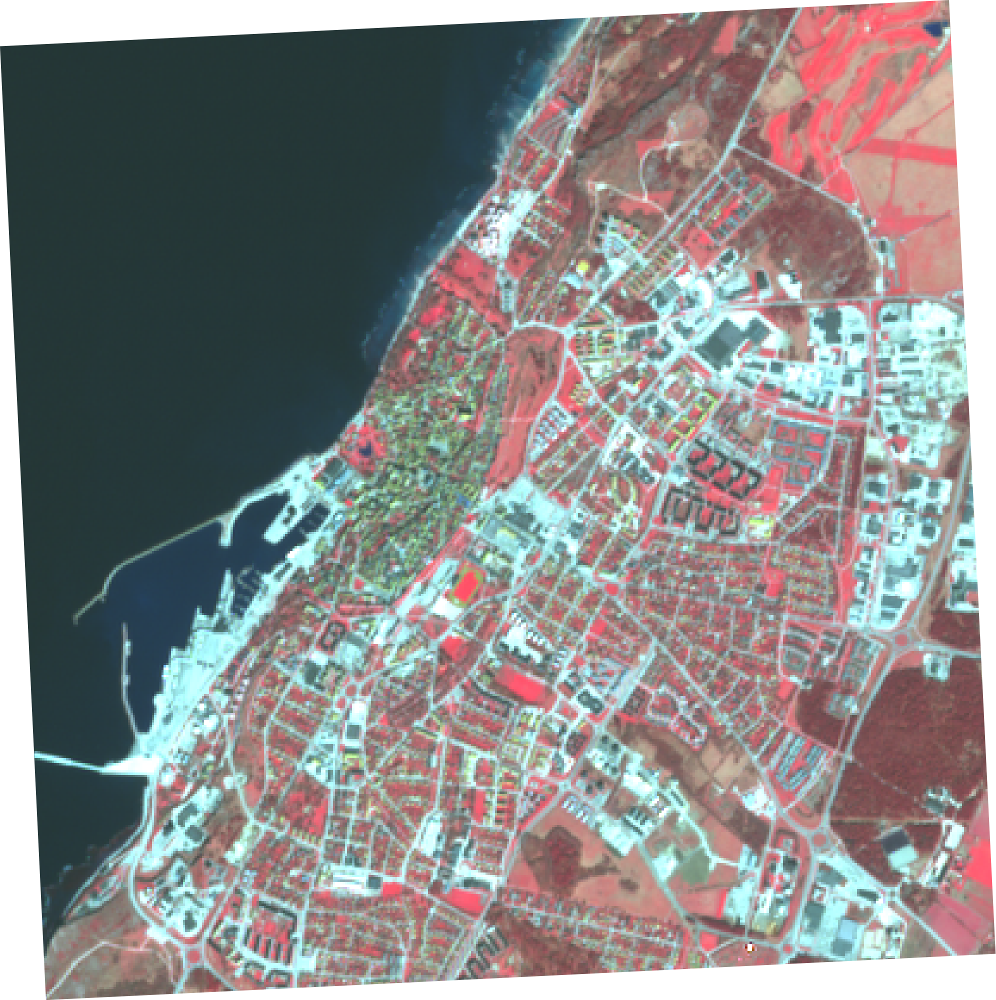

# MTF Satellite data API

This documentation describes how to use the satellite data API designed for MTF.

The API accepts a location as input, either latitude/longitude coordinates or a place name, and returns a time series of data recorded by the satellite. The response includes a url for downloading the image that the data represent. That way the user is free to either use the data values directly, or do something interesting with the imagery itself.

The satellite data that the API uses comes from the Sentinel 2 platform, which is part of the EU Copernicus project. The Sentinel 2 imagery has a 10 meter spatial resolution (i.e. one pixel covers a 10x10m patch of the earth surface). New images are captured by the satellite every two to five days for any given place on earth (the closer to the poles, the shorter the revisit time).

Sentinel 2 is an optical satellite that recors different parts of the electromagnetic spectrum into differnt bands. The values of these bands can then be combined in different ways to highlight certain things on the earth surface, such as presence/absence of vegetation, seasonal variations, etc.

# API

The base URL for the API is

<a href="https://mtf-sat.synvinkel.org" target="_blank">https://mtf-sat.synvinkel.org</a>

## API-key

All of the `/timeseries` request must include an `apikey` query parameter. 

Example:
```
/timeseries/london?apikey={Your API-key here}
```

## Timeseries

Getting timeseries data is done by providing a location, either by coordinates or place name, to the `/timeseries` endpoint. It returns a JSON like this:

```
{
    location: {"lng": 0, "lat": 0},
    images: [
        {
            bands: {
                    B1: 3645,
                    B2: 4324,
                    etc...
                },
            cloudcover: 30.8,
            date: "2018-06-05",
            url: "https://---imageurl---",
        },
        ...etc
    ]
}
```

Requests that fail for one reason or another will respond with an appropriate HTTP error code, and a hopefully helpful error message.


### By coordinates

A timeseries for a specific location can be requested by adding the `lng` and `lat` query parameters:

```
/timeseries?lng=106.18&lat=53.98
```

### By placename

Requesting by placename can be done with `/timeseries/{name}`

```
/timeseries/{name}
```

## Options

The following options can be appended  `/timeseries` to narrow down search.

Doing this a great way to make your request process faster, since only the data you are interested in needs processing.

### maxCloudCover

Use `maxCloudCover` to filter by cloud cover percentage. Must be a number between 0 and 100.

```
/timeseries/{name}?maxCloudCover=50
```

### fromDate, startDate

Filtering by a specific date range is done by providing `startDate` and `endDate` in YYYY-MM-DD format (e.g. 2018-01-31) 

```
/timeseries/{name}?startDate=2018-06-01&endDate=2018-07-23
```

### buffer

Use `buffer` to set a custom buffer around the requested point. The default buffer is 2000 meters. Buffer size greatly affects the processing time for both the timeseries and the images you get.

Setting the buffer to 0 will get the time series for the pixel at that location. The image url will be omitted from the result.

```
/timeseries/{name}?buffer=100
```

### season

To only include images taken during a certain season you can provide `spring`,`summer`,`fall` or `winter` for the `season` query parameter. Season is defined in a very much northen-hemispherocentric manner.

```
/timeseries/{name}?season=winter
```

# Images

The url provided in the timeseries result will process and return the requested image as a png. 

## Options

By default the image will be visualized as RGB truecolor. If you want to you can choose arbitrary band combinations by providing a comma separated string of bands as a `bands` parameter.

Some suggested band combinations to try out:

* **Natural Colors:** B4,B3,B2
* **False color Infrared:** B8,B4,B3
* **False color Urban:** B12,B11,B4
* **Agriculture:** B11,B8,B2
* **Atmospheric penetration:** B12,B11,B8A
* **Healthy vegetation:** B8,B11,B2
* **Land/Water:** B8,B11,B4
* **Natural Colors with Atmospheric Removal:** B12,B8,B3
* **Shortwave Infrared:** B12,B8,B4
* **Vegetation Analysis:** B11,B8,B4

### Example

Default RGB visualization (natural colors):
```
/image/18.30005/57.63845/20180421T100029_20180421T100427_T33VXD-7d0.png
```



False color near infra-read (NIR). Putting B8 into the red channel will highlight vegetation, since vegetation has high reflectance in the NIR part of the spectrum

```
/image/18.30005/57.63845/20180421T100029_20180421T100427_T33VXD-7d0.png?bands=B8,B4,B3
```




